# 🗺️ PuneWanderer

[](https://github.com/yourusername/punewanderer)
[](https://github.com/yourusername/punewanderer)
[](https://nextjs.org/)
[](https://www.typescriptlang.org/)
[](https://neo4j.com/)

> **AI-Powered Travel Planning with Knowledge Graphs & RAG**

PuneWanderer is an intelligent travel planning application that helps you discover and explore Pune's best places using advanced AI, Knowledge Graphs, and Retrieval-Augmented Generation (RAG). Plan personalized itineraries, visualize routes on interactive maps, and get smart recommendations powered by GraphRAG.

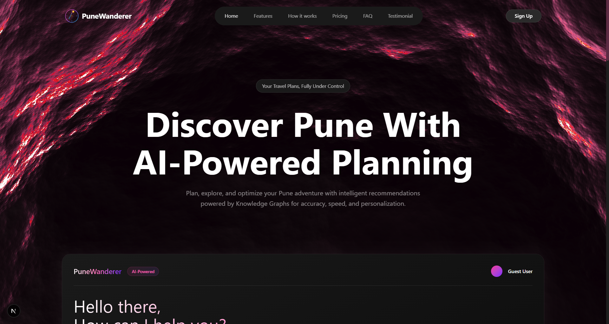

---

## ✨ Features

### 🤖 AI-Powered Chat Assistant
- Natural language trip planning
- Context-aware recommendations
- Multi-turn conversations with memory
- Intent classification for accurate responses

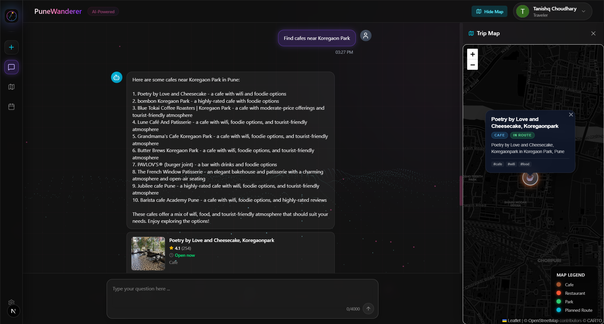

### 🗺️ Interactive Map Explorer
- **2820+ Places** visualized with marker clustering
- Real-time map rendering with Leaflet.js
- Category-based filtering (cafes, restaurants, parks, temples, etc.)
- Route visualization with neon-glow paths
- Dark theme with glassmorphism UI

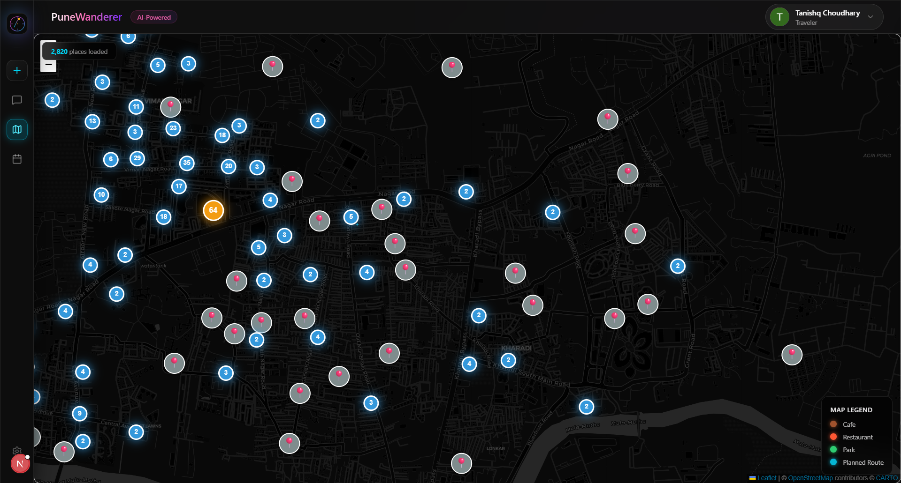

### 📊 Knowledge Graph Integration
- **Neo4j** graph database for connected data
- GraphRAG for intelligent retrieval
- Relationship-based recommendations
- Subgraph exploration

### 📅 Trip Calendar
- Visual itinerary planning
- Day-by-day schedule management
- Drag-and-drop interface

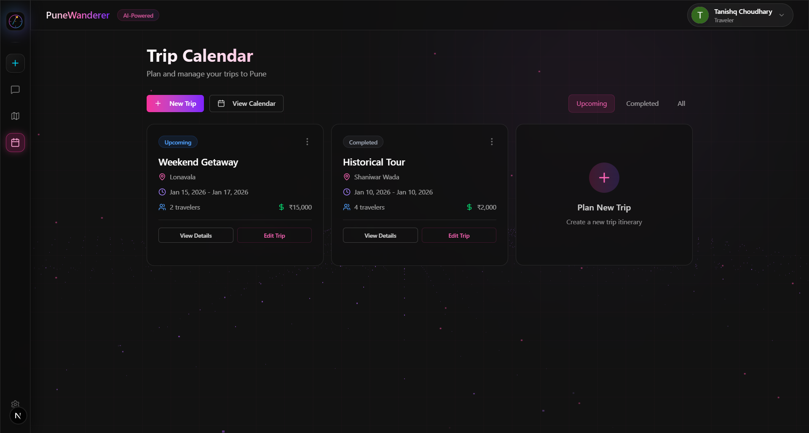

### 🎨 Modern UI/UX
- **Dark glassmorphism** design
- Smooth animations with Framer Motion
- Three.js particle backgrounds
- Responsive layout for all devices

---

## 🏗️ Architecture

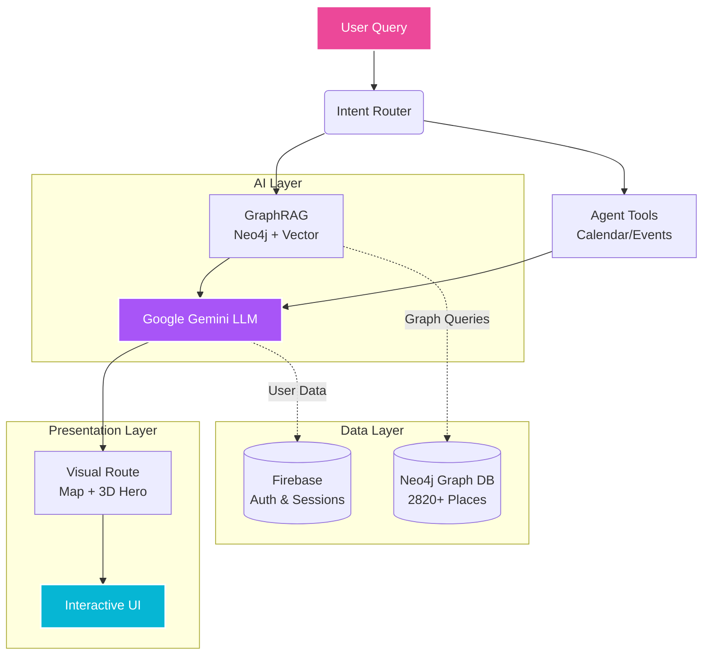

### Data Flow
1. **User Input** → Natural language query via chat interface
2. **Intent Classification** → Determines query type (itinerary, recommendation, question)
3. **GraphRAG Retrieval** → Fetches relevant places from Neo4j using graph traversal
4. **LLM Processing** → Google Gemini generates contextual responses
5. **Visualization** → Results displayed on map with route planning

---

## 🛠️ Tech Stack

### Frontend
- **Next.js 14** - React framework with App Router
- **TypeScript** - Type-safe development
- **Tailwind CSS** - Utility-first styling
- **Three.js** - 3D graphics and animations
- **Framer Motion** - Animation library
- **Leaflet.js** - Interactive maps
- **Leaflet.markercluster** - Map performance optimization

### Backend & Database
- **Neo4j** - Graph database for places and relationships
- **Firebase** - Authentication and user management
- **Vercel AI SDK** - AI chat integration
- **Google Gemini** - LLM for natural language processing

### AI & RAG
- **GraphRAG** - Graph-based retrieval augmented generation
- **Vector Search** - Semantic similarity search
- **Intent Classification** - User query understanding
- **Context Management** - Multi-turn conversation handling

### Performance Optimizations
- **Marker Clustering** - Handles 2820+ map markers efficiently
- **Chunked Loading** - Progressive data loading
- **Canvas Rendering** - Optimized map performance
- **Code Splitting** - Dynamic imports for faster load times

---

## 📸 Screenshots

### Landing Page

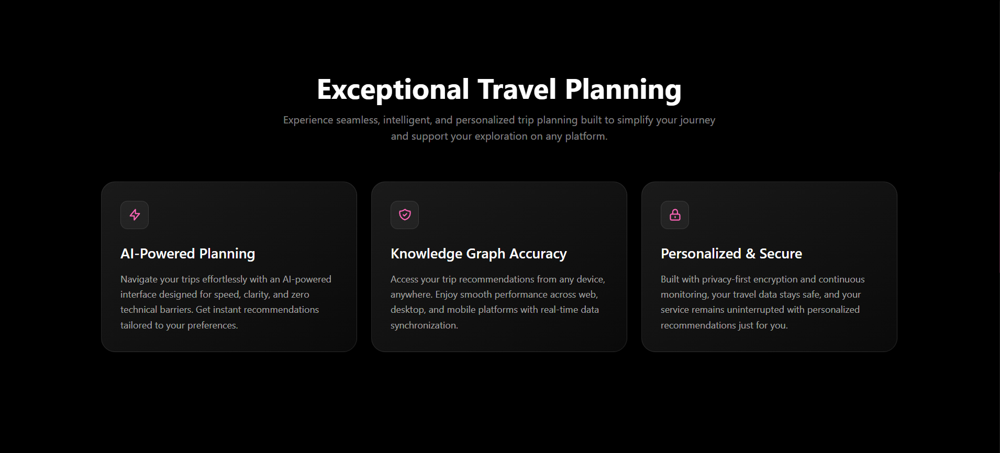
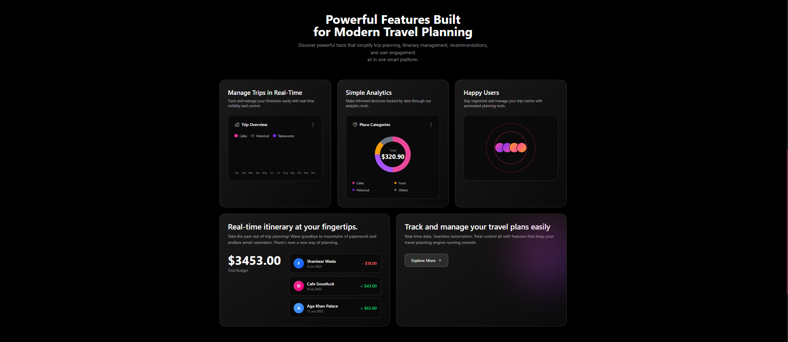
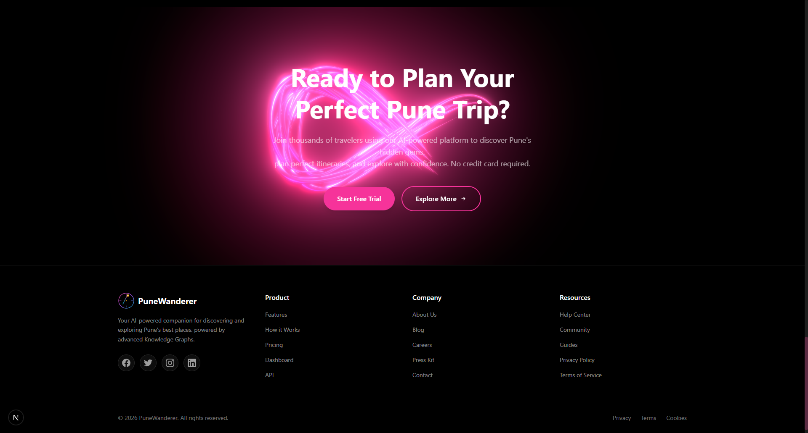

### Authentication
<div style="display: flex; gap: 10px;">
  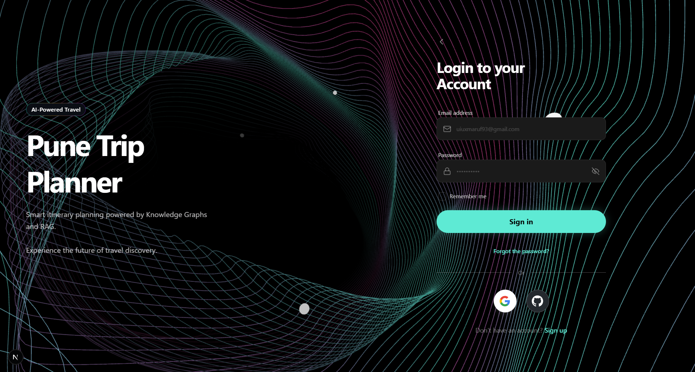
  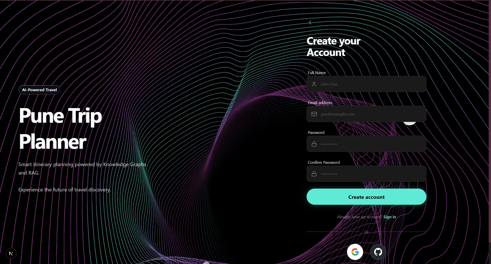
</div>

### Dashboard & Chat
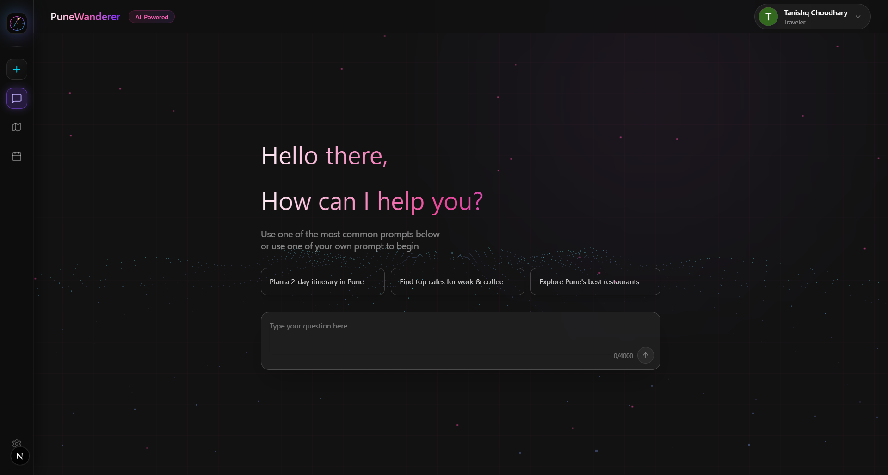

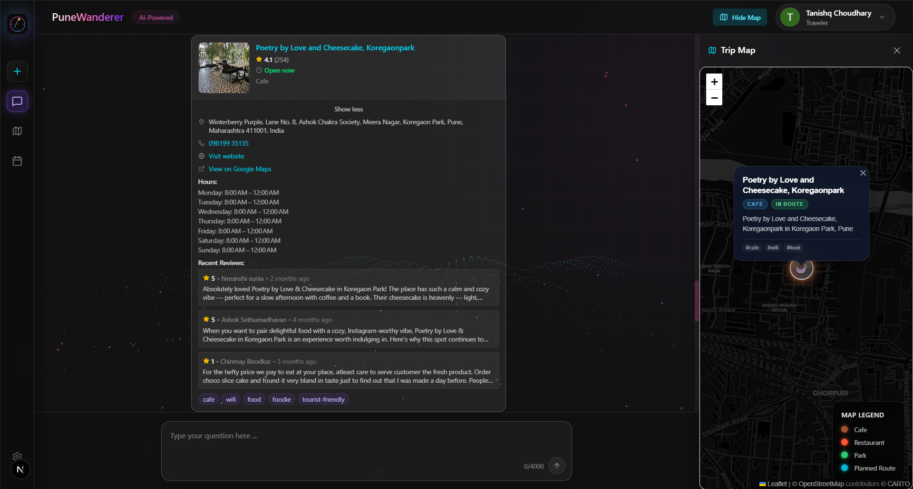

### Sidebars & Settings
<div style="display: flex; gap: 10px;">
  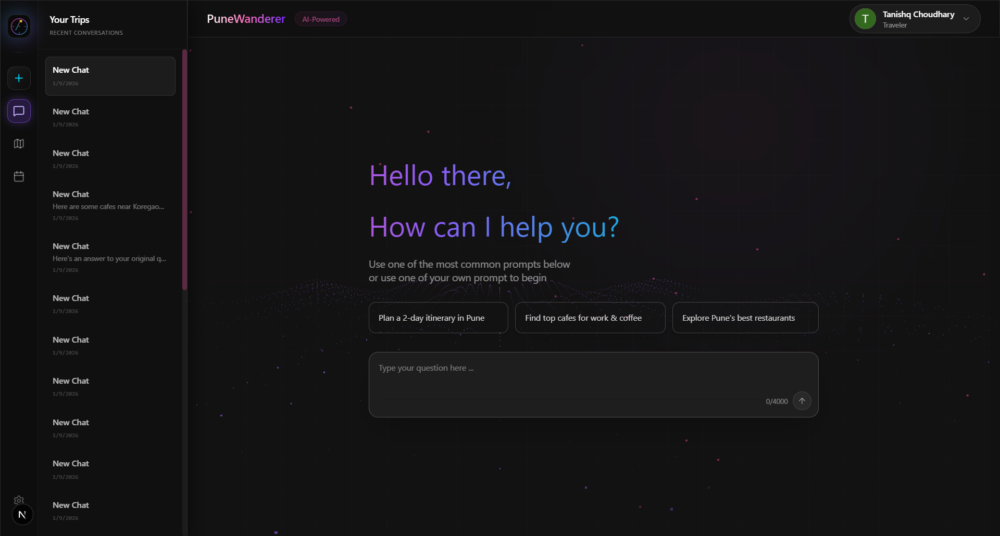
  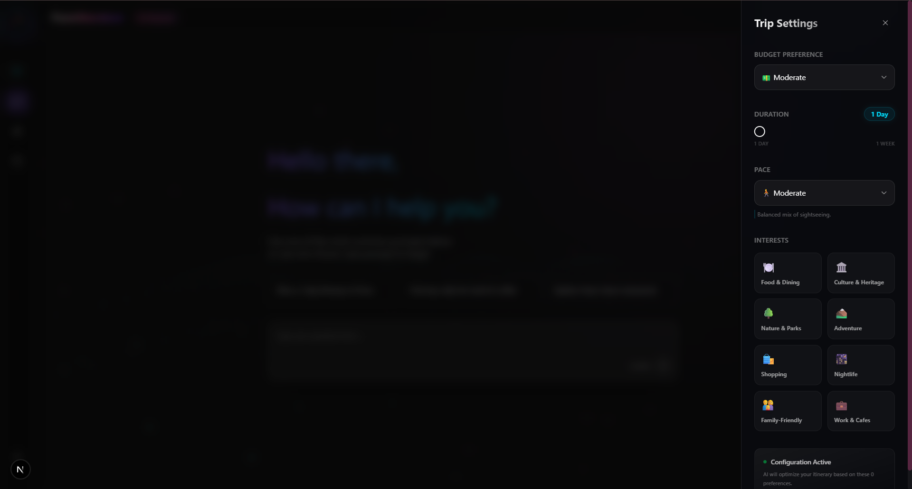
  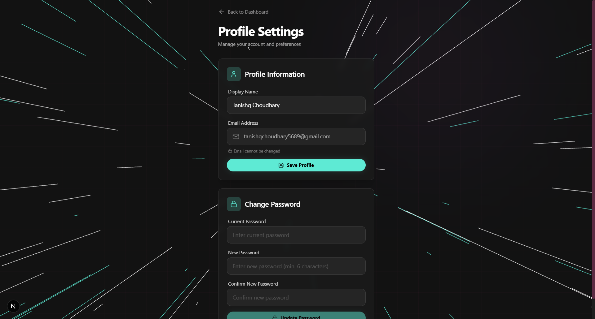
</div>

---

## 🚀 Getting Started

### Prerequisites
- Node.js 18+ and npm
- Neo4j database (local or cloud)
- Firebase project
- Google Gemini API key

### Installation

1. **Clone the repository**
   ```bash
   git clone https://github.com/yourusername/punewanderer.git
   cd punewanderer
   ```

2. **Install dependencies**
   ```bash
   npm install
   ```

3. **Set up environment variables**
   
   Create a `.env.local` file in the root directory:
   ```env
   # Firebase
   NEXT_PUBLIC_FIREBASE_API_KEY=your_firebase_api_key
   NEXT_PUBLIC_FIREBASE_AUTH_DOMAIN=your_auth_domain
   NEXT_PUBLIC_FIREBASE_PROJECT_ID=your_project_id
   NEXT_PUBLIC_FIREBASE_STORAGE_BUCKET=your_storage_bucket
   NEXT_PUBLIC_FIREBASE_MESSAGING_SENDER_ID=your_sender_id
   NEXT_PUBLIC_FIREBASE_APP_ID=your_app_id

   # Neo4j
   NEO4J_URI=bolt://localhost:7687
   NEO4J_USER=neo4j
   NEO4J_PASSWORD=your_neo4j_password

   # Google Gemini
   GOOGLE_GENERATIVE_AI_API_KEY=your_gemini_api_key

   # Google Maps (Optional - for 3D tiles)
   NEXT_PUBLIC_GOOGLE_MAPS_KEY=your_google_maps_key
   ```

4. **Set up Neo4j database**
   
   Import the Pune places dataset:
   ```bash
   # Start Neo4j
   neo4j start

   # Import data (example)
   LOAD CSV WITH HEADERS FROM 'file:///pune-places.csv' AS row
   CREATE (p:Place {
     place_id: row.place_id,
     name: row.name,
     category: row.category,
     lat: toFloat(row.lat),
     long: toFloat(row.long),
     rating: toFloat(row.rating),
     address: row.address
   })
   ```

5. **Run the development server**
   ```bash
   npm run dev
   ```

6. **Open your browser**
   
   Navigate to [http://localhost:3000](http://localhost:3000)

---

## 📁 Project Structure

```
punewanderer/
├── src/
│   ├── app/                    # Next.js App Router
│   │   ├── page.tsx           # Dashboard (main UI)
│   │   ├── landing/           # Landing page
│   │   ├── login/             # Authentication
│   │   ├── signup/
│   │   ├── settings/
│   │   └── api/               # API routes
│   │       ├── chat/          # Chat endpoints
│   │       └── graph/         # Neo4j graph queries
│   ├── components/
│   │   ├── chat/              # Chat UI components
│   │   ├── map/               # Map components
│   │   ├── calendar/          # Calendar components
│   │   ├── auth/              # Auth components
│   │   ├── brand/             # Logo & branding
│   │   ├── effects/           # Three.js effects
│   │   └── ui/                # Reusable UI components
│   ├── lib/
│   │   ├── agent/             # AI agent logic
│   │   ├── rag/               # GraphRAG implementation
│   │   ├── db/                # Database connections
│   │   └── auth/              # Auth context
│   ├── data/                  # Static data
│   ├── shaders/               # Custom GLSL shaders
│   └── utils/                 # Utility functions
├── public/                    # Static assets
├── screenshots/               # Project screenshots
└── .env.local                # Environment variables
```

---

## 🎯 Key Features Explained

### 1. GraphRAG Architecture
PuneWanderer uses a hybrid approach combining:
- **Graph Database (Neo4j)**: Stores places and their relationships
- **Vector Embeddings**: Semantic search for similar places
- **LLM Integration**: Natural language understanding with Google Gemini
- **Retrieval Pipeline**: Multi-hop graph traversal for context-aware recommendations

### 2. Map Performance Optimization
Handling 2820+ markers efficiently:
- **Marker Clustering**: Groups nearby markers into clusters
- **Chunked Loading**: Loads markers in 200ms chunks with 50ms delays
- **Canvas Rendering**: Uses Leaflet's canvas mode for better performance
- **Viewport Filtering**: Only renders visible markers

### 3. AI Chat System
- **Intent Classification**: Understands user queries (itinerary, recommendations, questions)
- **Context Management**: Maintains conversation history
- **Multi-turn Conversations**: Remembers previous interactions
- **Structured Responses**: Returns formatted itineraries with images

### 4. Authentication Flow
- Firebase Authentication with email/password
- Google OAuth integration
- GitHub OAuth integration
- Protected routes with auth redirects
- Persistent sessions

---

## 🎨 Design System

### Color Palette
- **Primary**: Pink (#ec4899) → Purple (#a855f7) → Cyan (#06b6d4)
- **Background**: Dark gradients (black → indigo-950 → slate-900)
- **Accent**: Gold (#fbbf24) for highlights
- **Text**: White with varying opacity (90%, 70%, 50%, 40%)

### Typography
- **Headings**: Bold, gradient text effects
- **Body**: Inter font family
- **Code**: Monospace for technical elements

### Components
- **Glassmorphism**: `backdrop-blur-xl` with dark backgrounds
- **Animations**: Smooth transitions with cubic-bezier easing
- **Shadows**: Layered shadows for depth
- **Borders**: Subtle white/10 borders

---

## 🔧 Configuration

### Map Settings
Adjust map clustering in `RouteMap.tsx`:
```typescript
const markerClusterGroup = L.markerClusterGroup({
  maxClusterRadius: 50,        // Cluster radius in pixels
  chunkedLoading: true,        // Enable chunked loading
  chunkInterval: 200,          // Chunk processing time
  chunkDelay: 50,              // Delay between chunks
});
```

### AI Settings
Configure AI behavior in `src/lib/agent/`:
- `intent-classifier.ts` - Query classification
- `graph-retriever.ts` - Graph traversal depth
- `chat-handler.ts` - Response formatting

---

## 📊 Performance Metrics

- **Initial Load**: ~2s
- **Map Rendering**: 2820 places in <1s
- **Chat Response**: ~2-3s (depends on LLM)
- **Bundle Size**: ~500KB (gzipped)
- **Lighthouse Score**: 90+ (Performance, Accessibility, Best Practices)

---

## 🤝 Contributing

Contributions are welcome! Please follow these steps:

1. Fork the repository
2. Create a feature branch (`git checkout -b feature/AmazingFeature`)
3. Commit your changes (`git commit -m 'Add some AmazingFeature'`)
4. Push to the branch (`git push origin feature/AmazingFeature`)
5. Open a Pull Request

---

## 📝 License

This project is licensed under the MIT License - see the [LICENSE](LICENSE) file for details.

---

## 🙏 Acknowledgments

- **Neo4j** for graph database technology
- **Google Gemini** for AI capabilities
- **Leaflet.js** for mapping functionality
- **Vercel** for hosting and deployment
- **Firebase** for authentication services

---

## 📧 Contact

For questions or feedback, reach out:
- **Email**: tanishqchoudhary5689@gmail.com
- **GitHub**: [@Tanishq4501](https://github.com/Tanishq4501)
- **LinkedIn**: [Tanishq Choudhary](https://linkedin.com/in/tanishqchoudhary-tc)

---

<div align="center">
  <strong>Built with ❤️ for travelers exploring Pune</strong>
  <br>
  <sub>Powered by AI, Knowledge Graphs, and Modern Web Technologies</sub>
</div>
